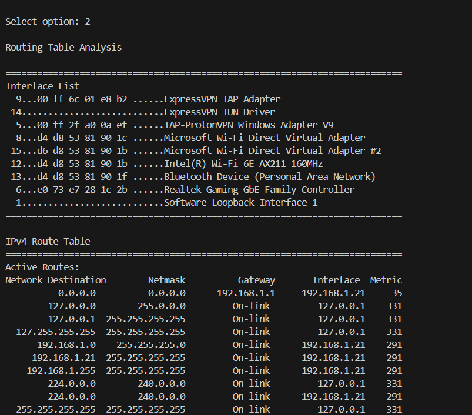
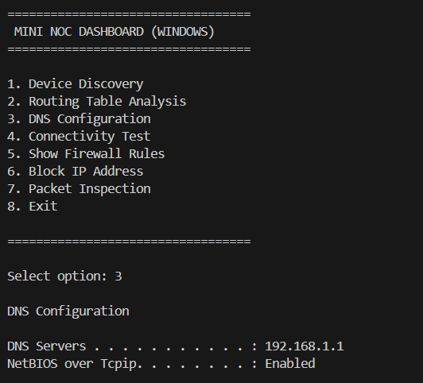
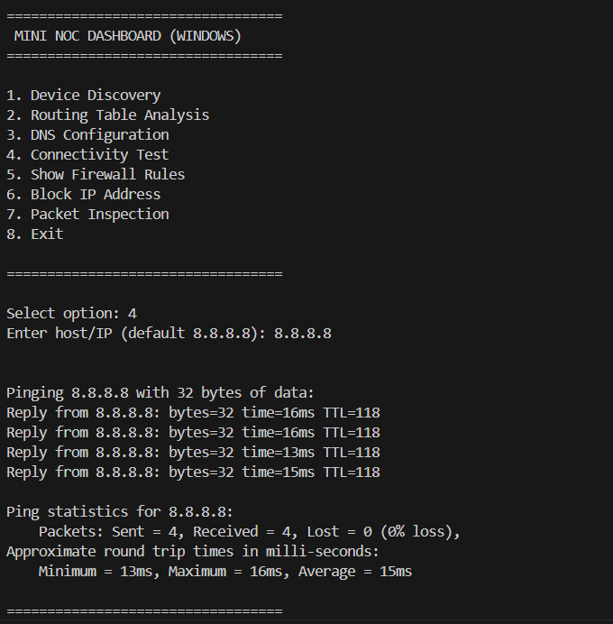

# Network Operations Center (NOC) Dashboard

A Python-based Network Operations Center (NOC) Dashboard for Windows that provides network monitoring, device discovery, routing table analysis, DNS inspection, connectivity testing, packet inspection, and firewall rule management.

## Features

### Device Discovery

* Scans a subnet using ICMP Ping Sweep
* Identifies active hosts on the network
* Performs hostname resolution

### Routing Table Analysis

* Retrieves and displays Windows routing table information
* Helps analyze network paths and gateways

### DNS Configuration Inspection

* Extracts configured DNS servers
* Assists in troubleshooting name resolution issues

### Connectivity Testing

* Performs ICMP ping tests
* Measures network reachability

### Firewall Rule Management

* Displays Windows Firewall rules
* Allows creation of custom IP blocking rules

### Packet Inspection

* Captures live packets using Scapy
* Identifies TCP, UDP, and ICMP traffic
* Provides basic network security monitoring

## Technologies Used

* Python
* Scapy
* Windows Networking Utilities
* Windows Firewall (netsh)

## Installation

Clone the repository:

```bash
git clone https://github.com/yourusername/NOC-Dashboard.git
cd NOC-Dashboard
```

Create a virtual environment:

```bash
python -m venv venv
```

Activate the virtual environment:

```bash
venv\Scripts\activate
```

Install dependencies:

```bash
pip install -r requirements.txt
```

## Running the Application

Run as Administrator:

```bash
python app.py
```

## Sample Functions

1. Device Discovery
2. Routing Table Analysis
3. DNS Configuration
4. Connectivity Test
5. Show Firewall Rules
6. Block IP Address
7. Packet Inspection

## Screenshots

Add screenshots of:

* Connectivity_test
* DNS_config
* Routing_Table_analysis

## Learning Outcomes

* Networking Fundamentals
* TCP/IP
* Routing
* DNS
* ICMP
* Packet Analysis
* Firewall Management
* Python Network Automation

## Disclaimer

This project is intended for educational and portfolio purposes. Run packet inspection and firewall modification features only on systems and networks you are authorized to manage.

## Screenshots

### Routing Table Analysis



---

### DNS Configuration



---

### Connectivity Test



